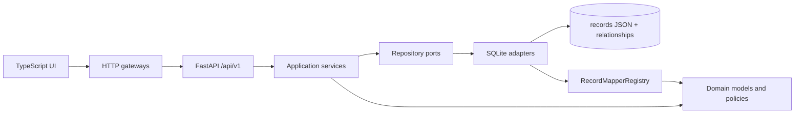
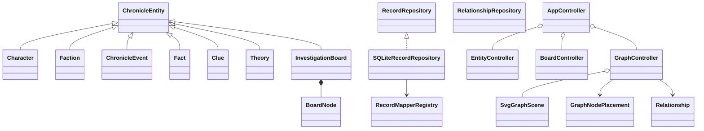
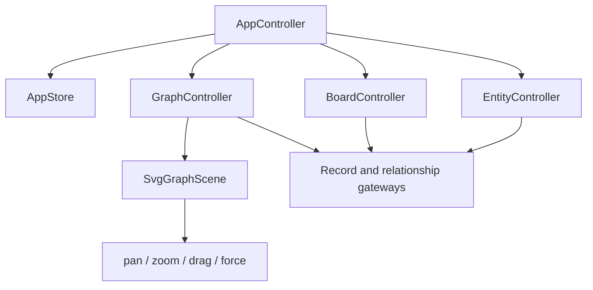

# Архитектура Chronicle

## Модульный Монолит

## Ключевые Классы

## Хранение Узлов

Игровые сущности не содержат координаты интерфейса.

- `InvestigationBoard.items[]` хранит `entity`, `id`, позицию, размер и стиль карточки только для конкретной доски.
- `graphLayouts.nodes[]` хранит `entity`, `id`, позицию, размер, стиль и `pinned` только для графа.
- запись сущности в `records` остаётся независимой от обеих визуальных раскладок.
- связь хранится один раз в таблице `relationships` и видна с обеих сторон.

## Ответственность Frontend

`GraphController` решает, какие узлы показать и как сохранить настройки. `SvgGraphScene` не знает о FastAPI и формах: она управляет только SVG, координатами и жестами.
